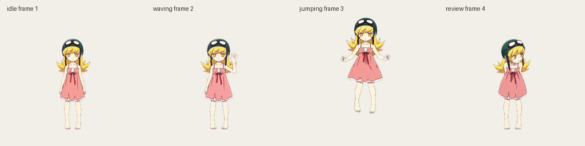

# 忍野忍 · Shinobu ChatGPT Pet

《化物语》头盔与护目镜造型的忍野忍动画宠物素材。保留深绿头盔、尖束金发、金色眼睛和粉裙红结，提供 **9 种动作、16 向视线，共 73 帧**。

An unofficial, AI-generated Shinobu Oshino animated companion sprite pack, using the Bakemonogatari helmet-and-goggles design. Includes nine animation states and sixteen look directions in a transparent Pets v2 sprite sheet.

## 动画预览

| 日常动作 | 视线跟随 |
| --- | --- |
|  |  |

[观看 MP4](previews/all-states.mp4) · [全部帧预览](previews/contact-sheet.png) · [16 向视线对照](previews/look-directions.png)

## 下载与规格

- [下载透明精灵图](assets/spritesheet.png)
- [下载 v1.0.0 发布包](https://github.com/Plastic-time/shinobu-chatgpt-pet/releases/tag/v1.0.0)
- 尺寸：**1536 × 2288 px**，RGBA PNG。
- 布局：8 列 × 11 行，每格 192 × 208 px。
- 前 9 行为动作，后 2 行为顺时针视线；0° 向上、90° 向右。
- 每行使用的帧数：`6, 8, 8, 4, 5, 8, 6, 6, 6, 8, 8`。
- 各动作时长与布局见 [sprite-layout.json](sprite-layout.json)。

这是面向接受 Pets v2 精灵图的导入工作流的素材包。上传 `assets/spritesheet.png` 时可将名称设为“忍野忍”。仓库不包含账号绑定信息；不会自动替其他用户安装或启用宠物。

## 动作一览

| 状态 | 帧数 | 表现 |
| --- | ---: | --- |
| `idle` | 6 | 待机 |
| `running-right` | 8 | 向右跑 |
| `running-left` | 8 | 向左跑 |
| `waving` | 4 | 挥手 |
| `jumping` | 5 | 跳跃 |
| `failed` | 8 | 失落 |
| `waiting` | 6 | 等待输入 |
| `running` | 6 | 思考工作 |
| `review` | 6 | 检查结果 |
| `look-a` | 8 | 视线前半圈 |
| `look-b` | 8 | 视线后半圈 |

`running` 表示专注思考的工作状态；移动由 `running-right` 和 `running-left` 表示。

## 制作与检查

图像使用内置 image generation 生成，再按统一尺寸提取、对齐、去除底色并组装。检查包括帧数、透明空格、角色大小、跳跃落点及视线方向。发布时仅清除文件元数据，PNG 与 GIF 的解码画面保持不变。

已通过本地布局与质量校验；原始成品通过 Pets 服务端预检。四个主要视线方向通过三份独立复核。部分相邻方向变化较轻，尤其 337.5° 的左向分量较弱，详见 [质量摘要](quality-summary.json)。

## 隐私与安全

发布内容经过单独整理，未包含本地制作工程包、用户目录、账号宠物 ID、上传会话、临时下载链接或登录凭据。媒体元数据已清理，提交使用 GitHub noreply 邮箱。检查范围与结果见 [SECURITY.md](SECURITY.md) 和 [privacy-audit.json](privacy-audit.json)。

## 角色与权利说明

这是个人制作的非官方同人素材项目，与《物语》系列权利方及 OpenAI 没有官方合作或背书。忍野忍及原作相关权利属于各自权利人；本仓库不附带第三方角色或商标的授权，也未为全部素材授予通用开源许可。

本仓库仅发布生成后的宠物成品与预览，不再分发参考用动画设定图。角色背景参考：[《物语》系列官网](https://www.monogatari-series.com/)。
