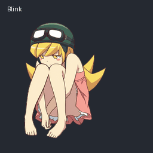
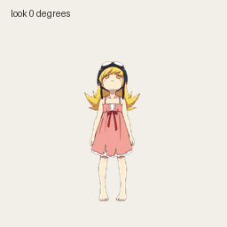
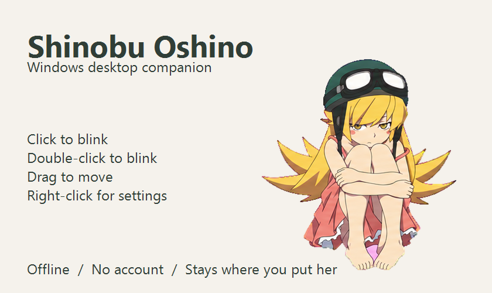

# 忍野忍 · Shinobu Oshino Pet

《化物语》头盔与护目镜造型的忍野忍宠物。深绿头盔、金发金瞳、粉裙红结，提供 **GPT 宠物版**和**独立桌宠版**，两个版本共用同一套角色动画。

An unofficial Shinobu Oshino companion in two editions: a ChatGPT Pets sprite pack and a standalone Windows desktop pet.

## 选择版本

| 版本 | 使用场景 | 下载与说明 |
| --- | --- | --- |
| **GPT 宠物版** | 在支持 Pets 的 ChatGPT Work 环境中使用 | [下载 GPT 版](https://github.com/Plastic-time/Shinobu-Oshino-pet/releases/tag/v1.0.0) · [使用说明](gpt/README.md) |
| **独立桌宠版** | 在 Windows 桌面独立运行，点击互动、拖动和视线跟随 | [下载 Windows 版](https://github.com/Plastic-time/Shinobu-Oshino-pet/releases/tag/v2.0.0) · [使用说明](desktop/USAGE.md) |

两个版本可以分别使用；版本号分别对应各自的发布包。

## GPT 宠物版

包含 **9 种动作、16 向视线，共 73 帧**。提供透明精灵图和动画布局文件，供 Pets 导入流程使用。

| 日常动作 | 视线动画 |
| --- | --- |
|  |  |

[透明精灵图](assets/spritesheet.png) · [全部帧预览](previews/contact-sheet.png) · [动画布局](sprite-layout.json)

## 独立桌宠版

解压后双击 `Shinobu-Oshino-pet.exe` 即可运行。默认固定在原地，单击挥手、双击跳跃，按住左键拖动，右键打开设置或退出。

支持四档大小、视线跟随、暂停动画和托盘菜单。离线运行，无需账号。适用于 Windows 10 / 11；已在 Windows 11 验证。

[操作说明](desktop/USAGE.md) · [源码与构建](desktop/README.md)

## 素材

精灵图为 1536 × 2288 px，8 列 × 11 行，每格 192 × 208 px。角色图像由 AI 图像生成工具生成，经提取、对齐、去底色和组装。

部分相邻视线方向较接近，尤其 337.5° 的横向变化较轻。

## 角色与许可

这是非官方同人项目。忍野忍及《物语》系列相关权利属于各自权利人，与原作权利方没有官方合作或背书。

[桌宠程序源码采用 MIT 许可](desktop/LICENSE)。角色图片、图标、动画和预览不适用该代码许可，本仓库不授予第三方角色或商标的授权。
