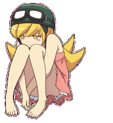

# 忍野忍 · Shinobu Oshino Pet

《化物语》头盔与护目镜造型的忍野忍宠物。深绿头盔、金发金瞳、粉裙红结，安静地抱膝坐着，偶尔眨眼。提供 **GPT 宠物版**和**独立 Windows 桌宠版**。

An unofficial Shinobu Oshino companion: a quietly seated pet with a gentle blink, available for ChatGPT Pets and Windows desktop.

## 选择版本

| 版本 | 使用场景 | 下载与说明 |
| --- | --- | --- |
| **GPT 宠物版** | 在支持 Pets 的 ChatGPT Work 环境中使用 | [下载 GPT 版](https://github.com/Plastic-time/Shinobu-Oshino-pet/releases/tag/v1.1.0) · [使用说明](gpt/README.md) |
| **独立桌宠版** | 在 Windows 桌面独立运行，点击眨眼、拖动定位 | [下载 Windows 版](https://github.com/Plastic-time/Shinobu-Oshino-pet/releases/tag/v2.1.0) · [使用说明](desktop/USAGE.md) |

两个版本可以分别使用，版本号分别对应各自的发布包。

## 当前表现

保持抱膝坐姿与清楚的双手，待机和点击互动时轻微眨眼。跑动、跳跃和鼠标转头已停用，各种触发保持同一坐姿和肤色。

## 独立桌宠版

解压后双击 `Shinobu-Oshino-pet.exe` 即可运行。单击或双击眨眼，按住左键拖动，右键打开设置或退出。

支持四档大小、暂停动画和托盘菜单。离线运行，无需账号。适用于 Windows 10 / 11；已在 Windows 11 验证。

## 素材与布局

GPT 版精灵图为 1536 × 2288 px，每格 192 × 208 px；独立版使用 3072 × 4576 px 的双倍像素资源，每格 384 × 416 px。

保留 Pets v2 的 8 列 × 11 行、73 个有效格布局。实际内容为坐姿与眨眼，其他动作和视线槽复用静止坐姿。布局中的状态名用于客户端兼容，不代表启用了对应动作。GPT 内的显示大小、位置和触发时机由客户端决定。

[透明精灵图](assets/spritesheet.png) · [全部格预览](previews/contact-sheet.png) · [布局文件](sprite-layout.json) · [桌宠源码](desktop/README.md)

角色图像由 AI 图像生成工具制作，经提取、对齐、去底色和组装。

## 角色与许可

这是非官方同人项目。忍野忍及《物语》系列相关权利属于各自权利人，与原作权利方没有官方合作或背书。

[桌宠程序源码采用 MIT 许可](desktop/LICENSE)。角色图片、图标、动画和预览不适用该代码许可，本仓库不授予第三方角色或商标的授权。
