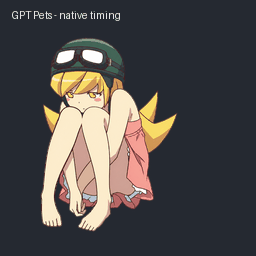

# GPT 宠物版 · 忍野忍

双膝收起，双手自然垂在腿间，安静坐着，偶尔眨眼。在支持自定义 Pets 的客户端中使用。

## 下载与使用

1. [下载 GPT 版 v1.2.0](https://github.com/Plastic-time/Shinobu-Oshino-pet/releases/tag/v1.2.0) 并解压。
2. 在支持自定义宠物的 Pets 工作流中，提供 `assets/spritesheet.png`，请求创建并选择“忍野忍”；已有此宠物时可请求更新。
3. 需要检查兼容布局和逐帧时长时，查看 `sprite-layout.json`。

请求示例：

> 使用附件中的精灵图创建并选择“忍野忍”。保留坐姿和眨眼；其他动作与视线槽保持静止。已有同名宠物时请先确认并更新原宠物。

此版需要可用的 Pets 功能和自定义宠物工作流。仅下载 PNG 不会自动启用宠物；具体入口以你的客户端为准。头像旁的显示位置与触发时机由客户端控制。

## 动作与画面

- 大腿、手臂和裙摆保持清楚的前后关系，坐姿使用统一光源下的明暗。
- 待机和点击时轻微眨眼，使用睁眼与闭眼两种状态。
- 图集保留六格待机和四格点击动作，其余兼容状态保持同一静止坐姿。
- 帧数和播放时长由客户端控制。
- 晃脚、跑动、跳跃和视线转动保持停用。

## 包含内容

- `assets/spritesheet.png`：透明精灵图。
- `sprite-layout.json`：兼容状态、实际表现与逐帧时长。
- `previews/`：GIF、MP4 和全部格预览。
- `SHA256SUMS`：文件校验值。

精灵图为 1536 × 2288 px，8 列 × 11 行，每格 192 × 208 px，共 73 个有效格。

非官方同人素材，角色及原作相关权利属于各自权利人。

[返回首页](../README.md) · [独立桌宠版](../desktop/USAGE.md)
